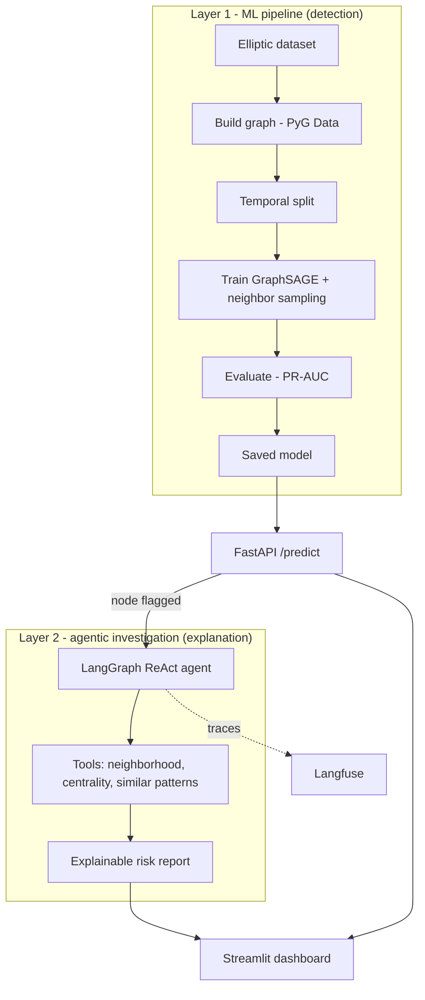

# Graph AML Detector

Graph neural network that detects money laundering in Bitcoin transactions,
paired with an agentic layer that investigates and explains each flagged node.

Status: in progress, started May 2026. The detection pipeline and the agent
layer are under active development. This README documents the target design;
sections will be marked done as they land.

## Problem

Money laundering hides illicit funds by spreading them across many
transactions. The signal lives in the network pattern, not in any single
transaction. A node receiving from 50 sources and sending to 50 destinations
in two hours is suspicious because of its position in the graph, not its
amount. Tabular models such as XGBoost miss this because they treat rows
independently. A graph model can read the topology directly.

## Approach

Two layers that connect:

- Detection: a GraphSAGE model classifies transactions as licit or illicit
  using both node features and graph structure.
- Investigation: when the model flags a node, a LangGraph ReAct agent
  inspects its neighborhood, computes centrality, looks for similar patterns,
  and writes a human-readable risk report.

A node only gets flagged by the GNN. The agent never detects; it explains.

## Architecture



## Key design decisions

- GraphSAGE over GCN/GAT: 204K nodes do not fit full-batch in 8GB; GraphSAGE
  supports neighbor sampling.
- Temporal split over random: a random split leaks future transactions into
  training, which inflates fraud-detection metrics.
- PR-AUC over accuracy: with around 2% positive class, predicting everything
  licit scores 98% accuracy and is useless.
- XGBoost baseline first: to prove empirically that the graph adds value over
  tabular features.

## Dataset

Elliptic dataset: around 204K real Bitcoin transactions, 166 features,
labeled licit/illicit. A standard, public AML-on-graphs benchmark.

## Tech stack

PyTorch Geometric, NetworkX, LangGraph, FastAPI, Pydantic, Streamlit,
Langfuse, Docker, GitHub Actions, deployed to Hugging Face Spaces.

## Setup

Built and tested on Pop!_OS with an RTX 4050 and CUDA 13.0 drivers, Python
3.11, pip and venv.

```bash
python3.11 -m venv .venv
source .venv/bin/activate
python -m pip install --upgrade pip

# PyTorch against CUDA 13.0
pip install torch==2.10.0 --index-url https://download.pytorch.org/whl/cu130

# PyG compiled extensions, matched to torch 2.10.0 + cu130
pip install pyg_lib torch_scatter torch_sparse -f https://data.pyg.org/whl/torch-2.10.0+cu130.html

# PyG core and the rest of the project
pip install torch-geometric
pip install -e '.[dev]'
```

## Roadmap

- [ ] Phase 0: repo scaffold and environment (current)
- [ ] Phase 1: graph and GNN fundamentals, EDA
- [ ] Phase 2: XGBoost baseline and PyG basics
- [ ] Phase 3: GraphSAGE training with neighbor sampling
- [ ] Phase 4: evaluation, baseline comparison, FastAPI
- [ ] Phase 5-6: LangGraph investigation agent
- [ ] Phase 7: Streamlit dashboard, Docker, Hugging Face Spaces

## License

MIT
